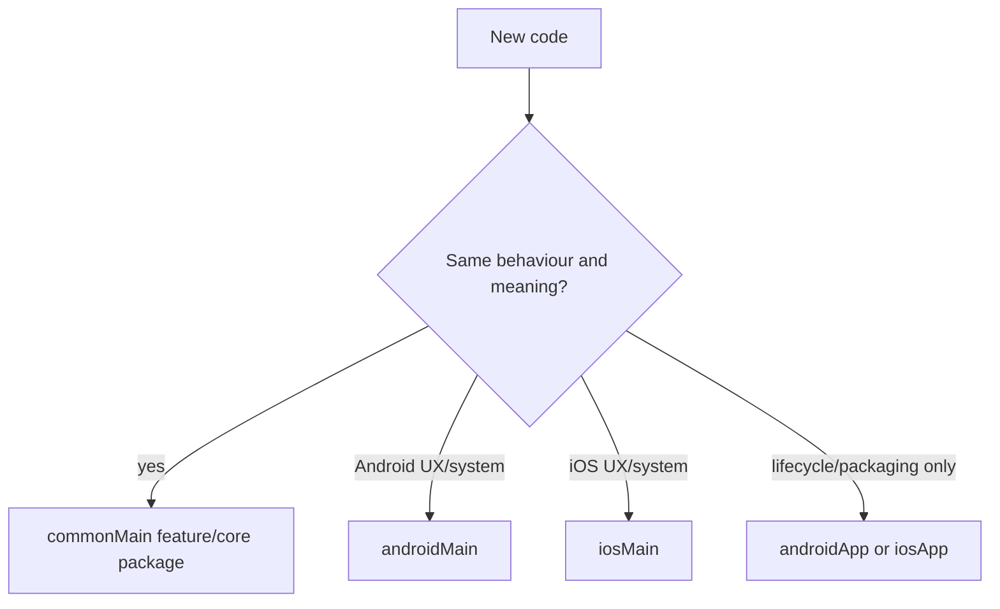

# Foundation playbook for agents

- **Status:** Accepted
- **Last updated:** 2026-07-23
- **Audience:** AI agents changing the `reader/` project

## Required reading

Before architecture or feature work, read `Agents.md`, `docs/README.md`, the relevant product document and glossary,
ADR-0001, [ADR-0002](../adr/0002-localization-and-navigation.md),
[platform foundation](../architecture/platform-foundation.md), and
[build contract](../engineering/build-and-quality.md). Markdown is canonical.

## Placement decision

| Answer | Destination |
|---|---|
| Same behaviour and meaning on both platforms | `commonMain`, behind a small interface when behaviour varies |
| Android Material/system behaviour | `androidMain` |
| iOS Apple/system behaviour | `iosMain` |
| Activity, SwiftUI host, signing or packaging | Host app module |

Use feature packages for product capabilities and `core` only for narrow cross-feature foundations. A module interface
must hide meaningful behaviour; do not create pass-through abstractions. One adapter is hypothetical, two adapters
make a real seam.

## TDD workflow

Work in vertical slices: one observable test fails, implement the minimum interface to make it pass, then refactor only
while green. Tests cross the same public interface as callers. Do not test private functions, implementation shape or
mock internal collaborators. Run the smallest relevant task after each cycle and the complete canonical gates before
handoff.

## Dependency admission

Before adding a library, record what non-trivial behaviour it owns, why the platform/standard library cannot provide
it, its KMP/platform support and maintenance risk. Implement one or two trivial functions locally. New versions belong
in `reader/gradle/libs.versions.toml`; never scatter versions through build scripts.

## Documentation parity

Every `docs/**/*.md` file has the same-path `.html` human view in the same commit. Markdown is normative. HTML may be
denser, but it must preserve every MUST/DO-NOT rule, stable ID, command, path, status, risk, consequence and graph edge.
Graphs require an adjacent text or table equivalent and must not be the only source of information. Run
`./scripts/verify-doc-pairs.sh`; semantic parity remains a review responsibility.

## Commit recipe

Prefer small explanatory commits such as: build reproducibility and gates; tested design-system seam; CI; canonical
documentation. Each commit should compile or document an intentional intermediate state, contain no generated build
output, and preserve unrelated user changes.

## ADR-0001 guardrails

Do not add account/sync ownership fields, nested tags, full-content extraction, a notification backend, dwell-time read
heuristics or Material-identical iOS UI. Reference accepted IDs instead of restating product decisions in code.

## ADR-0002 guardrails

- Use Navigation 3 for application navigation. Define `@Serializable`, typed,
  unique keys under a sealed `AppNavKey : NavKey` contract.
- Never introduce string routes, `Any` back stacks, mutable domain objects or
  display copy in navigation keys.
- Feature composables emit navigation callbacks/events; they do not receive a
  navigator or mutate the back stack.
- Android owns Navigation 3 `NavDisplay`; iOS renders the same Navigation 3
  runtime state through its platform adapter and never creates a parallel route
  model.
- Add user-visible and assistive strings to localizable resources in the first
  implementation slice. Shared copy uses Compose Multiplatform generated
  resources; genuinely platform-only copy uses native localized resources.
- Before release, perform the localization and navigation audits in the build
  contract. Hard-coded production UI copy is a release blocker.

## Handoff evidence

Report commit IDs, exact commands and outcomes, which platform builds were real, any toolchain limitation, remaining
accessibility/device risks, and the next smallest test-first feature slice.
