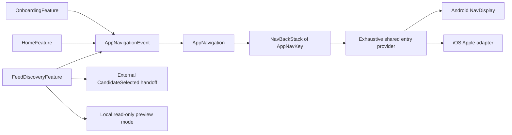

# App navigation integration tracer

- **Status:** Implemented integration slice
- **Last updated:** 2026-07-23
- **Scope:** Onboarding, data-free Home and existing feed-discovery integration for `PRD-001`, `PRD-005`, `PRD-011`,
  `PRD-013` and `PRD-014`
- **Product constraints:** [Core product](../product/core-product.md),
  [ADR-0001](../adr/0001-v1-product-foundation.md),
  [ADR-0002](../adr/0002-localization-and-navigation.md)

## One authoritative Navigation 3 runtime

`AppNavigation` is the public application-navigation interface used by the real
`App` caller and by navigation tests. It owns one
`NavBackStack<AppNavKey>` in `commonMain`; feature UI emits outcomes and never
receives a navigator or the stack.



| From | To | Contract |
|---|---|---|
| Onboarding, Home or Discovery outcome | `AppNavigationEvent` | `App` adapts typed feature outcomes; features remain navigation-free. |
| `AppNavigationEvent` | `AppNavigation.handle` | One deep module owns every stack mutation and root rule. |
| `AppNavigation` | `NavBackStack<AppNavKey>` | This is the only route state; no string route, `Any` stack or second state machine exists. |
| Back stack | Shared entry provider | A sealed exhaustive `when` resolves every concrete key without another destination model. |
| Entry provider | Android | `NavDisplay` renders the authoritative stack and owns Android back/predictive-back integration. |
| Entry provider | iOS | A Compose Foundation adapter renders `backStack.last()` and uses the iOS back dispatcher plus an opaque Apple-style back bar. |
| `CandidateSelected` | External caller and local preview | Return the existing handoff without changing the stack; the discovery entry consumes it as local read-only preview state. |

## Key and stack contract

`AppNavKey` is a sealed `NavKey`. Its three concrete keys are individually
`@Serializable` and have intentional identity:

- `AppNavKey.Onboarding` and `AppNavKey.Home` are `data object` singleton
  destinations.
- `AppNavKey.FeedDiscovery(website)` is a data class whose website is the stable
  identity required to reconstruct the existing discovery input.
- Keys contain no resource copy, mutable feature state, callbacks, services,
  composables or platform objects.

| Current stack or event | Result | Reason |
|---|---|---|
| First start | `[Onboarding]` | Onboarding remains the only first-run entry screen. |
| Root Onboarding + `UseApp` | `[Home]` | Home replaces onboarding; setup is not retained as a mandatory back step. |
| `[Home]` + `HomeOutcome.FollowWebsite` | `[Home, Onboarding]` | Reuse the existing website-entry screen. |
| Any top Onboarding + `FollowWebsite("example.com")` | append `FeedDiscovery("example.com")` | Start real discovery immediately, without confirmation. |
| Top Discovery + Edit Website | pop Discovery | Return to the exact website entry below it. |
| `[Home, Onboarding]` + `UseApp` | `[Home]` | Pop to the existing Home instead of adding a duplicate. |
| Back with more than one entry | pop one | Both platforms share deterministic hierarchical back. |
| Back at one root entry | `AtRoot`, no mutation | The platform remains free to exit/dismiss the app at its root. |
| `CandidateSelected` | `External(outcome)`, no mutation | Preserve the callback while the existing Discovery entry renders its local read-only preview mode. |

`EditWebsite` only pops when Discovery is actually on top. `UseApp` truncates to
an existing Home when present; otherwise it replaces the current stack with one
Home. An empty initial stack is rejected.

## Restoration and entry resolution

`rememberAppNavigation()` uses Navigation 3's serializable
`NavBackStack<AppNavKey>` with an explicit `SavedStateConfiguration` on Android
and iOS. Its `SerializersModule` registers all three `NavKey` subtypes, avoiding
the Android-only reflective fallback. Tests round-trip every concrete key,
restore a multi-entry typed stack, verify equality/uniqueness and exercise the
same exhaustive entry provider used by `App`.

The shared provider selects Onboarding, Home or Discovery directly from the key.
It returns no parallel enum or route object. Adding another concrete
`AppNavKey` makes the provider's `when` non-exhaustive until the mapping is
implemented.

## Platform and accessibility behaviour

Android owns only `PlatformAppNavigationHost.android.kt`. It passes the shared
stack to Navigation 3 `NavDisplay`, supplies a `NavEntry` for the shared
exhaustive content mapping and sends back events to `AppNavigation`. Feature
renderers keep their Material 3 Expressive structure.

iOS owns only `PlatformAppNavigationHost.ios.kt`. Navigation 3 UI is not assumed
to be KMP UI: the adapter reads the same runtime stack, renders its top entry,
uses Compose Multiplatform's iOS back dispatcher for platform back gestures and
shows a 52dp localized back action when a parent exists. The bar uses the
existing Apple semantic design roles and an honest opaque fallback; it does not
imitate or claim Liquid Glass.

The first visible heading in Onboarding, Home and Discovery receives heading
semantics and a focus request when its destination enters composition. This
gives TalkBack, VoiceOver, keyboard and switch users a deterministic starting
point after navigation. The only new visible/assistive label, “Zurück”, is
loaded from Compose resources. Platform back at a root is not captured.

TalkBack/VoiceOver announcement timing, iOS interactive-edge gesture feel,
predictive-back animation, switch/keyboard focus, largest text, orientation and
physical-device behaviour remain manual release checks. Compiler and host tests
cannot prove those interactions.

## Dependency admission

The version catalog pins Navigation 3 `1.1.4`. `navigation3-runtime` owns the
KMP `NavKey`, `NavBackStack` and restoration machinery in `commonMain`;
`navigation3-ui` owns Android `NavDisplay` only. The Kotlin serialization
compiler plugin uses the already pinned Kotlin `2.4.10`. Compose
`ui-backhandler` uses the already pinned Compose Multiplatform `1.11.1` and
connects the iOS adapter to platform back. `kotlinx-serialization-json` `1.11.0`
is test-only evidence for key and stack round trips. No other navigation library
is present.

These libraries own non-trivial cross-platform restoration, system-back and
scene behaviour; reimplementing them would contradict ADR-0002.

## TDD and verification evidence

This integration began with exactly one new public-interface tracer:

1. RED: `onboarding and home share one website journey without duplicating
   home` failed because `AppNavigation`, `AppNavigationEvent` and `AppNavKey`
   did not exist.
2. GREEN: the minimum shared Navigation 3 stack implemented first start,
   `UseApp`, Home's website entry, immediate Discovery, Edit Website and
   duplicate-free return to Home; the same focused test passed.

Later one-at-a-time tests added CandidateSelected external handoff, root-safe
back, serialization/restoration plus key identity, and exhaustive entry
resolution. The focused commands from `reader/` are:

```sh
ANDROID_HOME=/Users/philipp/Library/Android/sdk ./gradlew \
  :shared:testAndroidHostTest \
  --tests 'com.smponi.reader.core.navigation.AppNavigationTest'
ANDROID_HOME=/Users/philipp/Library/Android/sdk ./gradlew \
  :shared:compileAndroidMain :shared:compileKotlinIosSimulatorArm64
```

Canonical Android lint/build/R8, iOS test/compiler/Xcode and documentation gates
remain defined in [Build and quality contract](../engineering/build-and-quality.md).

## Scope boundary

This navigation slice still adds no preview key, subscription persistence, tags
behaviour, notifications, settings, permissions, database or preview-network
change. Discovery performs its existing request and `CandidateSelected` remains
the seam consumed by the separate
[read-only preview tracer](feed-preview-tracer.md) inside the current Discovery
entry. There is no new onboarding sequence or second route model.
