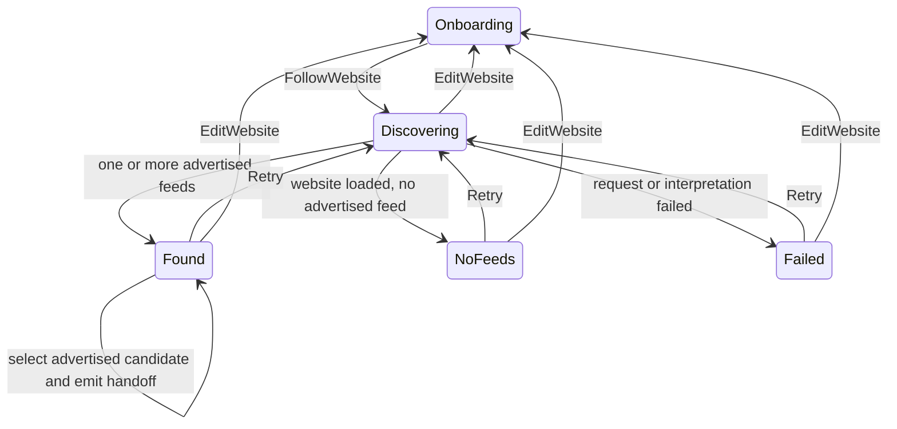

# Feed discovery and candidate-selection tracer

- **Status:** Implemented, navigation integrated and consumed by the read-only feed-preview tracer
- **Last updated:** 2026-07-24
- **Scope:** Real discovery plus the smallest explicit candidate-selection handoff for `PRD-001` and `PRD-011`,
  connected directly from `PRD-013`
- **Product constraints:** [Core product](../product/core-product.md),
  [ADR-0001](../adr/0001-v1-product-foundation.md)

## Public feature interface and state decision

`beginFeedDiscovery(OnboardingOutcome.FollowWebsite)` is the small public seam
shared by the app caller and tests. It immediately returns a `FeedDiscovery`
session in `FeedDiscoveryState.Discovering`. A missing scheme becomes `https://`;
an explicit `http://` or `https://` scheme is preserved.



| From | Action or observation | To | Contract |
|---|---|---|---|
| Onboarding | `FollowWebsite("example.com")` | `Discovering("https://example.com")` | Start immediately without confirmation or another onboarding screen. |
| Discovering | Successful website with supported declarations | `Found` | Expose all distinct advertised candidates; do not guess one. |
| Found | `select(candidate)` with a currently advertised candidate | `Found(selectedCandidate)` + `CandidateSelected` | Record exactly the caller's choice and emit its website/candidate handoff; never select implicitly. |
| Discovering | Successful website without supported declarations | `NoFeeds` | Distinguish a useful empty result from a network failure. |
| Discovering | HTTP, transport or interpretation failure | `Failed` | Preserve the website and expose Retry and Edit Website. |
| Found / NoFeeds / Failed | Retry | Discovering | Repeat the same discovery without re-entering the website. |
| Any discovery state | Edit Website | Onboarding | Return to entry without a navigation dependency or confirmation step. |

`FeedDiscovery` is the deep module: callers know the state, `discover()`,
`select(candidate)` and `close()`, while membership validation, HTTP, redirect
handling, response interpretation, URL resolution and failure normalisation remain
implementation details. `select` accepts only a candidate in the current `Found`
state, updates `selectedCandidate` and returns
`FeedDiscoveryOutcome.CandidateSelected`; stale or unrelated candidates produce no
handoff. Cancellation is rethrown so leaving the feature cancels work instead of
presenting a false failure.

## Candidate-selection behaviour

`Found` always begins with `selectedCandidate = null`, even when the website
advertises exactly one feed. Selecting a row is the explicit user decision and
simultaneously emits the small handoff consumed by the
[read-only preview](feed-preview-tracer.md). This keeps the
single- and multi-candidate paths identical, makes the selected state observable
when the caller remains on the screen, and prevents discovery from guessing among
multiple declarations.

`App` still forwards `FeedDiscoveryOutcome` through its public callback. The
feature also passes that exact outcome to `openFeedPreview`, renders the local
candidate metadata and keeps its `Found` state alive for Edit Selection. It does
not add a route, fetch or parse the feed, or persist a subscription.

## Discovery behaviour in this tracer

The production adapter performs one real Ktor GET. It follows the platform
client's redirect behaviour and interprets the final response:

- `application/rss+xml` and `application/atom+xml` responses become one direct
  candidate;
- HTML `<link>` declarations require `rel="alternate"` and one of those supported
  content types;
- absolute, scheme-relative, root-relative and path-relative `href` values are
  resolved against the final website URL;
- duplicate candidate URLs are removed while declaration order is preserved;
- a non-success HTTP response or thrown transport/interpretation exception becomes
  `Failed`;
- a successful page with no supported declaration becomes `NoFeeds`.

This is intentionally declaration-based discovery. It does not probe guessed
paths, parse feed XML, validate entries, preview content, persist a subscription
or fetch arbitrary article pages. Those behaviours require their own tests and
slices.

## App and platform ownership

`App` observes the existing onboarding callback and sends `FollowWebsite` to the
[shared Navigation 3 runtime](app-navigation-integration.md), which appends the
typed Discovery key and renders `FeedDiscoveryFeature`. Edit Website pops that
key to reveal the appropriate existing entry. Explicit selection still leaves
the stack unchanged and is forwarded through the separate
`onFeedDiscoveryOutcome` callback. The feature owns only local discovery and
selection state, switches locally to the preview renderer after the public
handoff is consumed, and receives neither a navigator nor a back stack.

| Source set | Ownership | Platform contract |
|---|---|---|
| `commonMain/feature/discovery` | Session, states, explicit selection/outcome, candidate meaning, Ktor response interpretation, feature lifecycle and local preview-mode handoff | No Material or Apple component chrome; no preview implementation or subscription pipeline |
| `androidMain/feature/discovery` | Material 3 result and single-choice screen | Semantic theme roles, expressive type/list treatment, tonal selected state, radio semantics and at least 48dp candidate targets |
| `iosMain/feature/discovery` | Apple-native-in-spirit result and single-choice screen | Compose Foundation, Apple semantic tokens, opaque rounded rows, checkmark plus selected semantics and 52dp candidate targets; no `MaterialTheme` or fake glass |
| `androidApp` | Android capability declaration | `INTERNET` is a normal install-time capability, not a runtime permission prompt |

The Android renderer uses the existing Material 3 theme seam. Its candidate rows
form one semantic selection group and pair Material selection state with tonal
surface roles. The iOS renderer uses an opaque, rounded list with an explicit
checkmark and selected semantics; real Liquid Glass remains a native host decision
and is not imitated with Compose blur.

## Accessibility contract and evidence

- Every state has a heading and explanatory text; colour or progress graphics are
  never the only state signal.
- Loading always exposes “Feeds werden gesucht” semantics and an immediate Edit
  Website action. Android suppresses the indeterminate visual when Reduced Motion
  is active; the textual state remains.
- Found exposes every candidate as a named single-choice target, including selected
  semantics; the selected row also shows a radio/checkmark indicator rather than
  relying on colour alone. No candidate is selected automatically.
- Empty and failure states expose a named Retry action. Every state exposes Edit
  Website. Interactive targets are at least 48dp; Android Retry is 56dp and iOS
  actions and candidate rows are 52dp.
- Width-constrained, vertically scrollable layouts reflow at large text sizes and
  in landscape. Candidate titles and URLs remain text rather than icon-only cues.
- Platform previews cover a two-candidate selected state and both platform
  compilers cover the actual renderers and callback handoff.

TalkBack, VoiceOver, switch/keyboard traversal, largest text, increased contrast,
orientation and physical-device targets remain manual release gates. Compilation
and semantic declarations do not replace those checks.

## Dependency admission

This slice admits Ktor `3.5.1` because the observable behaviour now includes real
HTTP/TLS requests, redirects, cancellation and Android/iOS engine integration.
The common client plus Android and Darwin engines own non-trivial platform
networking that should not be reimplemented. `kotlinx-coroutines` `1.11.0` owns
the cancellable asynchronous feature lifecycle and deterministic coroutine tests.

No serialization library, HTML parser, navigation library, DI framework or
feed-parser dependency was added by the Discovery slice. The later app
integration admits Navigation 3 separately and is documented in
[App navigation integration](app-navigation-integration.md). The small
declaration scanner is local because it owns only the `<link>` attributes needed
by this tracer.

## TDD and verification evidence

The first cycle was exactly one public-interface tracer:

1. RED: `normal website begins feed discovery immediately` failed because
   `beginFeedDiscovery` and `FeedDiscoveryState` did not exist.
2. GREEN: the minimum session normalised `example.com` to
   `Discovering("https://example.com")`.

Later one-at-a-time cycles added observable candidate, HTML declaration, failure
and empty-result behaviour through the feature or its real Ktor adapter. This
slice began with exactly one new public-interface cycle:

1. RED: a caller could not observe that two discovered candidates began
   unselected, select the second candidate, or receive a
   `CandidateSelected` handoff.
2. GREEN: `Found.selectedCandidate` and `FeedDiscovery.select(candidate)` added
   only that observable behaviour; the same test then passed.

The relevant commands are:

```sh
cd reader
ANDROID_HOME=/Users/philipp/Library/Android/sdk ./gradlew \
  :shared:testAndroidHostTest
ANDROID_HOME=/Users/philipp/Library/Android/sdk ./gradlew \
  :shared:compileKotlinIosSimulatorArm64
```

Canonical repository gates remain defined in
[Build and quality contract](../engineering/build-and-quality.md).

## Subsequent smallest test-first slice

The [read-only preview tracer](feed-preview-tracer.md) now consumes
`FeedDiscoveryOutcome.CandidateSelected` using only local candidate metadata.
Next, add an injectable read-only preview source with explicit
Loading/Available/Failed behaviour and only enough real feed-provided identity or
recent-entry evidence to replace its honest no-data state. Do not persist a
subscription, add tags or notifications, fetch original pages, build a complete
ingestion pipeline or introduce a full navigation graph in advance.
`OnboardingOutcome.UseApp` is now connected to the accessible Home shell by the
separate app-navigation integration.
