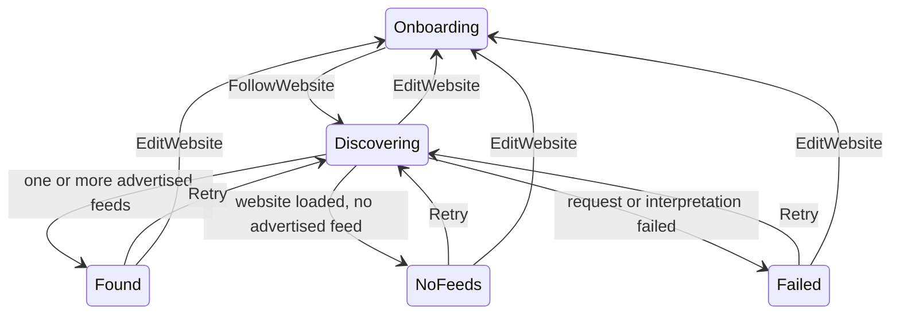

# Feed discovery tracer bullet

- **Status:** Implemented tracer; feed selection, preview and subscription remain open
- **Last updated:** 2026-07-23
- **Scope:** Smallest real network slice for `PRD-001` and `PRD-011`, connected directly from `PRD-013`
- **Product constraints:** [Core product](../product/core-product.md),
  [ADR-0001](../adr/0001-v1-product-foundation.md)

## Public feature interface and state decision

`beginFeedDiscovery(OnboardingOutcome.FollowWebsite)` is the small public seam
shared by the app caller and tests. It immediately returns a `FeedDiscovery`
session in `FeedDiscoveryState.Discovering`. A missing scheme becomes `https://`;
an explicit `http://` or `https://` scheme is preserved.



| From | Action or observation | To | Contract |
|---|---|---|---|
| Onboarding | `FollowWebsite("example.com")` | `Discovering("https://example.com")` | Start immediately without confirmation or another onboarding screen. |
| Discovering | Successful website with supported declarations | `Found` | Expose all distinct advertised candidates; do not guess one. |
| Discovering | Successful website without supported declarations | `NoFeeds` | Distinguish a useful empty result from a network failure. |
| Discovering | HTTP, transport or interpretation failure | `Failed` | Preserve the website and expose Retry and Edit Website. |
| Found / NoFeeds / Failed | Retry | Discovering | Repeat the same discovery without re-entering the website. |
| Any discovery state | Edit Website | Onboarding | Return to entry without a navigation dependency or confirmation step. |

`FeedDiscovery` is the deep module: callers know the state, `discover()` and
`close()`, while HTTP, redirect handling, response interpretation, URL resolution
and failure normalisation remain implementation details. Cancellation is rethrown
so leaving the feature cancels work instead of presenting a false failure.

## Discovery behaviour in this tracer

The production adapter performs one real Ktor GET. It follows the platform
client's redirect behaviour and interprets the final response:

- `application/rss+xml` and `application/atom+xml` responses become one direct
  candidate;
- HTML `<link>` declarations require `rel="alternate"` and one of those supported
  content types;
- absolute, scheme-relative, root-relative and path-relative `href` values are
  resolved against the final website URL;
- duplicate candidate URLs are removed while declaration order is preserved;
- a non-success HTTP response or thrown transport/interpretation exception becomes
  `Failed`;
- a successful page with no supported declaration becomes `NoFeeds`.

This is intentionally declaration-based discovery. It does not probe guessed
paths, parse feed XML, validate entries, preview content, choose among candidates,
persist a subscription or fetch arbitrary article pages. Those behaviours require
their own tests and slices.

## App and platform ownership

`App` observes the existing onboarding callback. It still forwards every
`OnboardingOutcome` to its caller, while `FollowWebsite` additionally swaps the
local content to `FeedDiscoveryFeature`. `UseApp` remains untouched and does not
force an app shell into this slice. The feature owns only a local attempt counter;
no navigation framework or long-lived app graph was introduced.

| Source set | Ownership | Platform contract |
|---|---|---|
| `commonMain/feature/discovery` | Session, states, candidate meaning, Ktor response interpretation, feature lifecycle and renderer seam | No Material or Apple component chrome; no subscription pipeline |
| `androidMain/feature/discovery` | Material 3 result screen | Semantic theme roles, headline/type scale, tonal candidate cards, 56dp primary Retry, 48dp secondary action |
| `iosMain/feature/discovery` | Apple-native-in-spirit result screen | Compose Foundation, Apple semantic tokens, opaque rounded surfaces, 52dp actions; no `MaterialTheme` or fake glass |
| `androidApp` | Android capability declaration | `INTERNET` is a normal install-time capability, not a runtime permission prompt |

The Android renderer uses the existing Material 3 theme seam. The iOS renderer
uses the documented opaque fallback; real Liquid Glass remains a native host
decision and is not imitated with Compose blur.

## Accessibility contract and evidence

- Every state has a heading and explanatory text; colour or progress graphics are
  never the only state signal.
- Loading always exposes “Feeds werden gesucht” semantics and an immediate Edit
  Website action. Android suppresses the indeterminate visual when Reduced Motion
  is active; the textual state remains.
- Result, empty and failure states expose a named Retry action and an Edit Website
  action. Interactive targets are at least 48dp; Android Retry is 56dp and iOS
  actions are 52dp.
- Width-constrained, vertically scrollable layouts reflow at large text sizes and
  in landscape. Candidate titles and URLs remain text rather than icon-only cues.
- Platform previews cover a real result and both platform compilers cover actual
  renderers.

TalkBack, VoiceOver, switch/keyboard traversal, largest text, increased contrast,
orientation and physical-device targets remain manual release gates. Compilation
and semantic declarations do not replace those checks.

## Dependency admission

This slice admits Ktor `3.5.1` because the observable behaviour now includes real
HTTP/TLS requests, redirects, cancellation and Android/iOS engine integration.
The common client plus Android and Darwin engines own non-trivial platform
networking that should not be reimplemented. `kotlinx-coroutines` `1.10.2` owns
the cancellable asynchronous feature lifecycle and deterministic coroutine tests.

No serialization library, HTML parser, navigation library, DI framework or
feed-parser dependency was added. The small declaration scanner is local because
it owns only the `<link>` attributes needed by this tracer.

## TDD and verification evidence

The first cycle was exactly one public-interface tracer:

1. RED: `normal website begins feed discovery immediately` failed because
   `beginFeedDiscovery` and `FeedDiscoveryState` did not exist.
2. GREEN: the minimum session normalised `example.com` to
   `Discovering("https://example.com")`.

Later one-at-a-time cycles added observable candidate, HTML declaration, failure
and empty-result behaviour through the feature or its real Ktor adapter. The
relevant commands are:

```sh
cd reader
ANDROID_HOME=/Users/philipp/Library/Android/sdk ./gradlew \
  :shared:testAndroidHostTest
ANDROID_HOME=/Users/philipp/Library/Android/sdk ./gradlew \
  :shared:compileKotlinIosSimulatorArm64
```

Canonical repository gates remain defined in
[Build and quality contract](../engineering/build-and-quality.md).

## Next smallest test-first slice

Starting from `FeedDiscoveryState.Found`, define the smallest candidate-selection
outcome that supports both one and multiple advertised feeds without guessing.
Connect that outcome to a feed preview in a later vertical slice. Do not add
subscription persistence, tags, notifications, a full navigation graph or an
onboarding confirmation step in advance. `OnboardingOutcome.UseApp` remains a
separate accessible-empty-shell slice.
