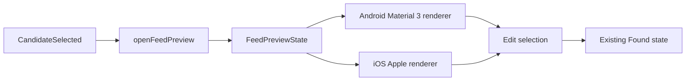

# Read-only feed-preview tracer

- **Status:** Implemented
- **Last updated:** 2026-07-24
- **Scope:** Candidate metadata already present in `FeedDiscoveryOutcome.CandidateSelected` for `PRD-001`, `PRD-011`
  and `PRD-014`
- **Product constraints:** [Core product](../product/core-product.md),
  [ADR-0001](../adr/0001-v1-product-foundation.md),
  [ADR-0002](../adr/0002-localization-and-navigation.md)

## Public interface and honest data boundary

`openFeedPreview(FeedDiscoveryOutcome.CandidateSelected)` is the one public seam
used by the feature caller and its test. It returns `FeedPreviewState` containing
exactly the selected website and `FeedCandidate`. The state has no entry/article
collection, loading status, subscription action or hidden repository.



| From | To | Contract |
|---|---|---|
| `CandidateSelected` | `openFeedPreview` | Consume the exact public discovery handoff; do not fetch, parse or persist. |
| `openFeedPreview` | `FeedPreviewState` | Preserve website, candidate title and candidate URL without inventing article evidence. |
| State | Android renderer | Use Material 3 semantic roles and an expressive tonal hierarchy. |
| State | iOS renderer | Use Apple-native-in-spirit grouped opaque surfaces; do not imitate Liquid Glass with blur. |
| Either renderer | Edit selection | Return locally to the existing `FeedDiscoveryState.Found`; do not restart discovery. |

The preview is a local mode inside the existing typed
`AppNavKey.FeedDiscovery` entry. Candidate selection still leaves the
Navigation 3 stack unchanged and the existing external callback remains
observable. A new key would need to carry remote display text or introduce a
second non-restorable state store, so this slice deliberately does neither.

## Platform ownership

| Source set | Owns | Must not own |
|---|---|---|
| `commonMain/feature/preview` | Immutable preview meaning, public handoff consumption, renderer seam | Network, feed parsing, entries, subscription state, Material or Apple chrome |
| `commonMain/feature/discovery` | Keeps the discovery session and selected `Found` state alive while preview is visible | Preview appearance, new navigation model |
| `androidMain/feature/preview` | Material 3 cards, semantic color/type roles, 56dp edit action | iOS styling, raw theme colors |
| `iosMain/feature/preview` | Compose Foundation text, grouped opaque surfaces, 52dp edit action | `MaterialTheme`, fake glass, a second route graph |

No dependency was added. All app-owned visible and assistive preview strings are
Compose resources. Website, title and URLs are remote data and remain unmodified.

## Accessibility and platform behaviour

- Both layouts are width constrained and vertically scrollable so Dynamic Type,
  Android font scaling, landscape and narrow windows can reflow rather than clip.
- The preview heading receives heading semantics and focus when the local mode
  enters composition.
- Candidate metadata is grouped meaningfully, while Website and Feed Address
  retain visible labels. The title and URLs remain text, not icon-only cues.
- “Keine Artikeldaten verfügbar” explicitly distinguishes missing evidence from
  an empty feed; no fabricated rows, counts, dates, authors or summaries appear.
- Android uses `MaterialTheme` tonal pairs and a 56dp `FilledTonalButton`. iOS
  uses Apple semantic tokens, opaque rounded groups and a 52dp text action.
- Every action is keyboard/switch focusable through platform components or
  explicit focus semantics. Color is never the only information carrier.

TalkBack and VoiceOver announcement order, largest supported text, long unbroken
remote URLs, increased contrast, switch/keyboard traversal, orientation,
physical touch targets and iOS navigation-bar interaction remain manual release
checks. Compilers and semantic declarations cannot prove them.

## TDD and verification evidence

This slice began with exactly one public-interface tracer:

1. RED: `candidate handoff becomes preview without inventing article data`
   failed because `openFeedPreview` and `FeedPreviewState` did not exist.
2. GREEN: the minimum immutable projection preserved the handoff's website and
   candidate; the same focused test passed.

The focused commands from `reader/` are:

```sh
ANDROID_HOME=/Users/philipp/Library/Android/sdk ./gradlew \
  :shared:testAndroidHostTest \
  --tests 'com.smponi.reader.feature.preview.FeedPreviewTest'
ANDROID_HOME=/Users/philipp/Library/Android/sdk ./gradlew \
  :shared:compileAndroidMain :shared:compileKotlinIosSimulatorArm64
```

Canonical format, lint, Android debug/release/R8, iOS test/Xcode and documentation
gates remain defined in
[Build and quality contract](../engineering/build-and-quality.md).

## Scope boundary and next smallest slice

This slice adds no feed request, XML parser, entry/article model, original-page
fetch, subscription persistence, tags, notifications, settings, permissions,
sync or Home content. Home remains functionally empty.

The next smallest test-first slice is an injectable, read-only preview source for
the selected feed URL with explicit Loading/Available/Failed behaviour. It may
fetch and interpret only enough real feed-provided identity or recent-entry
evidence to replace the honest no-data state. It must retain retry/edit recovery
and must not subscribe, persist, fetch original pages or become a complete
ingestion pipeline.
