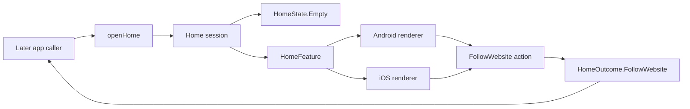

# Home shell tracer

- **Status:** Implemented UI shell; onboarding and feed-discovery integration remain open
- **Last updated:** 2026-07-23
- **Scope:** Data-free Home shell for `PRD-005`, `PRD-011`, `PRD-013` and `PRD-014`
- **Product constraints:** [Core product](../product/core-product.md),
  [ADR-0001](../adr/0001-v1-product-foundation.md),
  [ADR-0002](../adr/0002-localization-and-navigation.md)

## Public feature interface

`openHome()` creates a `Home` session in `HomeState.Empty`. The later app caller
passes that same public session to `HomeFeature` and receives
`HomeOutcome.FollowWebsite` when the person chooses the only executable action.
The same session interface is the test seam.



| From | To | Contract |
|---|---|---|
| Later app caller | `openHome()` | Create the shell explicitly; no navigation or onboarding state is inferred. |
| `openHome()` | `Home` | Expose only the truthful empty state and one action-to-outcome transition. |
| `Home` | `HomeFeature` | The caller and renderer use the same public session tested by the tracer. |
| `HomeFeature` | Android/iOS renderer | Share state and intent while each platform owns structure and chrome. |
| Both renderers | `HomeAction.FollowWebsite` | Only “Website folgen” is interactive. |
| `FollowWebsite` | Caller | Emit `HomeOutcome.FollowWebsite`; this slice does not consume or navigate from it. |

`HomeState.Empty` means Inbox has no unread entries, Saved has no saved entries,
and there are no followed websites or tags. Those areas are structured,
non-interactive status surfaces. They do not expose button, link, selected or
disabled-control roles, so assistive technology is not promised unavailable
navigation. The website-following control is enabled and ends at the callback
seam.

## Scope boundary and Navigation 3

This slice does not edit `App`, onboarding or discovery and does not connect any
route. It adds no `AppNavKey`, raw string route, back stack or platform route
graph. That omission is intentional: a key without an integrated destination
would be navigation built on speculation.

The later integration slice must consume `OnboardingOutcome.UseApp`, create or
reuse the required concrete `@Serializable AppNavKey`, render `HomeFeature` from
the exhaustive entry provider, and consume `HomeOutcome.FollowWebsite` through a
typed event. The feature must continue to receive neither a navigator nor a back
stack. Localized copy, callbacks and mutable state must not enter a navigation
key.

## Design and platform ownership

The visual thesis is a calm reading room before any sources exist. A single
vertical “reading margin” inside the empty-state surface is the signature
element; it encodes the product's reading focus rather than decorating the
screen. Everything else uses restrained type, whitespace and semantic surfaces.

| Source set | Ownership | Rendering contract |
|---|---|---|
| `commonMain/feature/home` | Empty state, follow-website action/outcome and renderer seam | No feed pipeline, persistence, tags logic, navigation or component chrome |
| `commonMain/composeResources` | Every new visible Home string | Generated `Res.string` accessors; no Home copy literal in production Kotlin |
| `androidMain/feature/home` | Material 3 Expressive shell | Material color/type/shape roles, 56dp action, compact column below 600dp, constrained two-area composition from 600dp, single column again at font scale 1.5+, 1040dp maximum content width |
| `iosMain/feature/home` | Apple-native-in-spirit shell | Compose Foundation controls, Apple design-system roles, 52dp action, compact and wide compositions, opaque rounded surfaces |

Android uses tonal surface separation rather than decorative shadows, the
existing dynamic/static Material colour scheme, Material typography and Material
shapes. The layout follows the existing 4/8dp foundation spacing scale. No new
adaptive-layout dependency is admitted for one centralized width decision.

iOS has no native control in this slice that would materially benefit from a
SwiftUI Liquid Glass seam. It therefore uses the honest opaque fallback. It does
not import `MaterialTheme`, add blur, or call a Compose imitation Liquid Glass.
A native glass treatment remains a host-level option only when an integrated
Apple control needs it.

## Localization and accessibility contract

- Home copy is stored in
  `shared/src/commonMain/composeResources/values/strings.xml` and loaded through
  generated Compose Multiplatform resource accessors.
- Headline, empty-state title and “Deine Bereiche” expose heading semantics in
  visible traversal order.
- The only control has a text name, button role, keyboard/switch focus support
  and a minimum height of 56dp on Android or 52dp on iOS.
- Inbox, Saved, websites and tags expose visible label-plus-empty-status text.
  They are not controls and do not rely on colour to communicate emptiness.
- Compact and wide content is vertically scrollable. At font scale 1.5 or above,
  both platforms force the single-column composition to protect reflow.
- Android colour pairings come from `primaryContainer/onPrimaryContainer`,
  `surfaceContainer/onSurface` and other intended Material roles. iOS uses the
  platform design-system semantic pairs.
- There is no animation or translucent material. Reduced Motion and Reduce
  Transparency therefore need no alternative effect in this shell.
- Compact and wide previews exist for both platform renderers.

TalkBack, VoiceOver, switch/keyboard traversal, the largest supported text,
increased contrast, light/dark appearance, orientation, fold/hinge placement and
physical target size remain manual release gates. Compilation and semantics
declarations do not replace those checks.

## Dependency and TDD evidence

The slice activates the already version-catalogued Compose Multiplatform
resources artifact. It owns generated, locale-aware accessors required by
`ADR-0002`/`PRD-014`; implementing localization accessors locally would duplicate
the selected Compose toolchain. No other dependency is added.

Exactly one new public-interface tracer was used:

1. RED: `empty home offers an honest website-following handoff` failed because
   `openHome`, `HomeState`, `HomeAction` and `HomeOutcome` did not exist.
2. GREEN: the minimal `Home` session exposed `HomeState.Empty` and converted
   `HomeAction.FollowWebsite` to `HomeOutcome.FollowWebsite`; the same test passed.
3. Platform renderers and resource loading were then added while that tracer
   remained green. No second Home test was added.

Relevant focused commands from `reader/`:

```sh
ANDROID_HOME=/Users/philipp/Library/Android/sdk ./gradlew \
  :shared:testAndroidHostTest --tests 'com.smponi.reader.feature.home.HomeTest'
ANDROID_HOME=/Users/philipp/Library/Android/sdk ./gradlew \
  :shared:compileAndroidMain :shared:compileKotlinIosSimulatorArm64
```

Canonical repository gates remain defined in
[Build and quality contract](../engineering/build-and-quality.md).

## Next integration slice

Connect `OnboardingOutcome.UseApp` to this Home feature and route
`HomeOutcome.FollowWebsite` back into the existing website-entry/discovery
journey using the accepted Navigation 3 key contract. Do not add feed data,
subscription persistence, tag logic, settings or preview behaviour while making
that connection.
