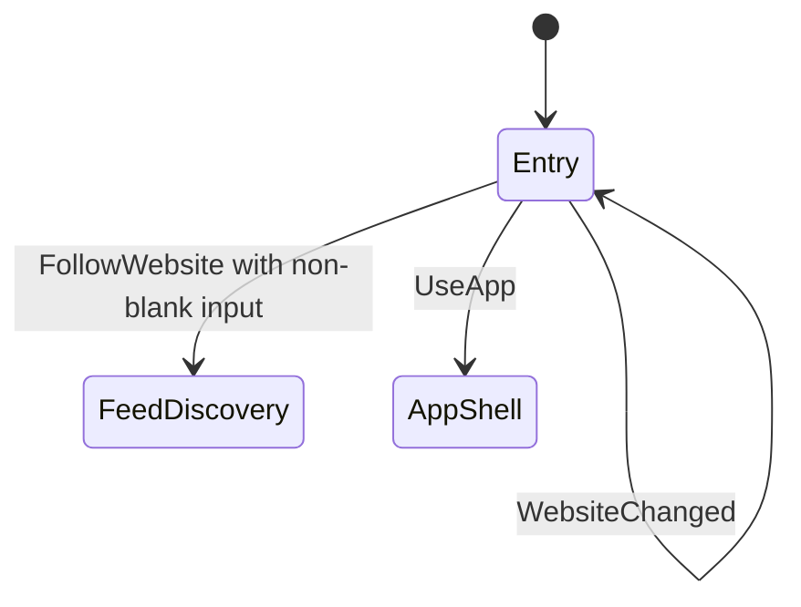

# Onboarding tracer bullet

- **Status:** Implemented and visually completed entry screen; feed discovery is connected and the app shell remains open
- **Last updated:** 2026-07-23
- **Scope:** Completed first onboarding screen for `PRD-013`, `PRD-011` and `PRD-014`
- **Product constraints:** [Core product](../product/core-product.md),
  [ADR-0001](../adr/0001-v1-product-foundation.md),
  [ADR-0002](../adr/0002-localization-and-navigation.md)

## UX and state-model decision

Onboarding is one actionable screen, not a sequence. It combines the immediate
value proposition with a website field, the primary “Website folgen” action and
a lower-emphasis direct entry into the app. It has no Next action, page indicator,
marketing carousel, feature tour, preference, account or permission prompt.



| From | Action | To | Contract |
|---|---|---|---|
| Start | None | Entry | The website field and both destinations are already available; no mandatory pre-step exists. |
| Entry | `WebsiteChanged` | Entry | Preserve exactly what the person is editing. |
| Entry | `FollowWebsite` with non-blank input | Feed-discovery handoff | Trim surrounding whitespace and emit the website; discovery owns parsing, validation and network errors. |
| Entry | `FollowWebsite` with blank input | Entry | Emit no outcome; `OnboardingState.canFollowWebsite` is false and the primary control is disabled. |
| Entry | `UseApp` | App-shell handoff | Emit immediately without setup, preferences or permissions. |

`OnboardingModel` is the shared behaviour module and its public interface is the
test seam. It deliberately does not know navigation, persistence, feed formats or
networking. The model derives `canFollowWebsite` from the editable value so the
caller and both renderers share one whitespace rule instead of reimplementing
action availability. `OnboardingFeature` adapts that model to two real renderers.
`App` still exposes both outcomes to its caller and consumes `FollowWebsite`
internally through the [feed-discovery tracer](feed-discovery-tracer.md). `UseApp`
remains an unconnected app-shell handoff rather than a new onboarding state.

## Platform ownership

| Source set | Rendering contract | Must not contain |
|---|---|---|
| `commonMain/feature/onboarding` | State, derived action availability, actions, outcomes and renderer seam | Material or Apple component chrome, feed validation, navigation |
| `commonMain/composeResources` | Every visible and assistive Onboarding string, including separate Android and iOS voice | Navigation identity, remote content or platform chrome |
| `androidMain/feature/onboarding` | Material 3 screen, expressive type scale, tonal action surface, URI keyboard and 56dp primary action | iOS styling or shared navigation assumptions |
| `iosMain/feature/onboarding` | Compose Foundation screen with Apple typography, focus treatment, opaque action surface and URI keyboard | `MaterialTheme`, fake blur or a claim of Liquid Glass |

Android and iOS copy may differ in voice while preserving the same action meaning.
All copy is loaded through generated `Res.string` accessors. The Android renderer
uses `MaterialTheme` surface-container, typography and shape roles. The iOS
renderer uses the documented opaque fallback with an Apple-semantic border and a
visible accent focus ring. True Liquid Glass belongs in the native host seam when
a supported native control materially improves the UX; a Compose blur must never
be labelled Liquid Glass.

## Adaptive layout and information hierarchy

The screen spends expression on one thing: a large, platform-specific promise.
The rest is a quiet action surface with one field, one primary action and one
lower-emphasis exit. There is no decorative illustration, feed preview or
animation competing with the first meaningful action.

Both adapters keep a single linear layout below `720dp`. At `720dp` and above,
the promise and action surface become two columns while retaining the semantic
order “promise, field, primary action, secondary action.” Content is vertically
scrollable, receives IME padding and is constrained to `600dp`/`1040dp` on
Android and `560dp`/`1000dp` on iOS. This makes phone portrait, phone landscape,
tablet and large-text layouts reflow without stretching reading lines across the
window.

## Accessibility contract and evidence

- The promise and action-surface title are headings. Each responsive layout is an
  explicit traversal group whose promise precedes the action surface.
- The website field has a stable localized accessible name, visible label,
  supporting instruction, URI keyboard and guarded Go action.
- Android uses Material text-field and button semantics. iOS exposes editable-text
  semantics, button role, disabled state and a visible keyboard-focus outline on
  its Foundation controls. Native clickable/focusable actions remain available to
  screen readers, hardware keyboards and switch access.
- Text reflows inside a vertically scrollable, width-constrained layout instead of
  clipping at large text sizes or in landscape.
- All actions are at least 48dp; primary actions are 56dp on Android and 52dp on iOS.
- Theme semantic colours supply text, surface, outline, accent and disabled states;
  colour is not the only signal because enabled state is also semantic.
- This tracer has no decorative motion and no transparent material. Reduced Motion
  and Reduce Transparency therefore require no alternative animation or surface.
- Shared behaviour is covered through `OnboardingModel` using the same interface as
  callers. Dedicated Android and iOS previews expose compact state plus a
  `900×500dp`, `1.6×` font-scale landscape/disabled state for visual inspection;
  Android lint and both platform compilers cover implementation integration.

TalkBack, VoiceOver, switch/keyboard traversal, largest text, increased contrast,
orientation and real-device target checks remain release gates. Compilation and
semantics declarations are not substitutes for those checks.

## Dependency and scope record

The slice activates the Compose Multiplatform resources artifact already pinned by
the repository's Compose version. It owns generated, localizable resource access
required by `ADR-0002` and is not a new third-party technology or version. No
navigation, persistence, feed parsing, animation, image loading or dependency
injection was added.

## TDD tracer evidence

This completion slice added exactly one public-interface RED→GREEN tracer before
rendering work:

1. RED: `blank website keeps the follow action unavailable` used
   `OnboardingModel.state`, the same interface consumed by `OnboardingFeature`,
   and failed to compile because `canFollowWebsite` did not exist.
2. GREEN: `OnboardingState.canFollowWebsite` derived availability from
   `website.isNotBlank()`; the same focused test passed without platform code.

The focused command was:

```sh
cd reader
ANDROID_HOME=/Users/philipp/Library/Android/sdk ./gradlew \
  :shared:testAndroidHostTest \
  --tests 'com.smponi.reader.feature.onboarding.OnboardingModelTest'
```

## Connected downstream slice

`OnboardingOutcome.FollowWebsite` now starts real feed discovery through the
public feature interface and renders actionable loading, result, empty and failure
states on Android and iOS. The next discovery behaviour belongs to its own feature
slice; onboarding must not gain an intermediate confirmation screen. Separately,
connect `OnboardingOutcome.UseApp` to an accessible empty app shell.
