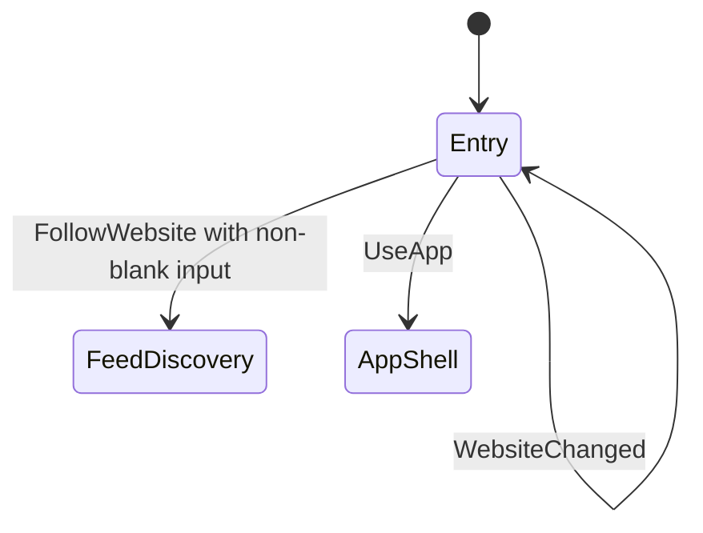

# Onboarding tracer bullet

- **Status:** Implemented tracer; feed discovery is connected and the app shell remains open
- **Last updated:** 2026-07-23
- **Scope:** First vertical slice for `PRD-013` and the onboarding portion of `PRD-011`
- **Product constraints:** [Core product](../product/core-product.md),
  [ADR-0001](../adr/0001-v1-product-foundation.md)

## UX and state-model decision

Onboarding is one actionable screen, not a sequence. It combines the immediate
value proposition with a website field, the primary “Website folgen” action and
a lower-emphasis direct entry into the app. It has no Next action, page indicator,
marketing carousel, feature tour, preference, account or permission prompt.

| From | Action | To | Contract |
|---|---|---|---|
| Start | None | Entry | The website field and both destinations are already available; no mandatory pre-step exists. |
| Entry | `WebsiteChanged` | Entry | Preserve exactly what the person is editing. |
| Entry | `FollowWebsite` with non-blank input | Feed-discovery handoff | Trim surrounding whitespace and emit the website; discovery owns parsing, validation and network errors. |
| Entry | `FollowWebsite` with blank input | Entry | Emit no outcome; the primary control is disabled while blank. |
| Entry | `UseApp` | App-shell handoff | Emit immediately without setup, preferences or permissions. |

`OnboardingModel` is the shared behaviour module and its public interface is the
test seam. It deliberately does not know navigation, persistence, feed formats or
networking. `OnboardingFeature` adapts that model to two real renderers. `App`
still exposes both outcomes to its caller and now consumes `FollowWebsite`
internally through the [feed-discovery tracer](feed-discovery-tracer.md).
`UseApp` remains an unconnected app-shell handoff rather than a new onboarding
state.

## Platform ownership

| Source set | Rendering contract | Must not contain |
|---|---|---|
| `commonMain/feature/onboarding` | State, actions, outcomes and renderer seam | Material or Apple component chrome, feed validation, navigation |
| `androidMain/feature/onboarding` | Material 3 screen, expressive type scale, tonal theme roles, URI keyboard and 56dp primary action | iOS styling or shared navigation assumptions |
| `iosMain/feature/onboarding` | Compose Foundation screen with Apple typography, spacing, solid controls and URI keyboard | `MaterialTheme`, fake blur or a claim of Liquid Glass |

Android and iOS copy may differ in voice while preserving the same action meaning.
The iOS tracer uses the documented opaque fallback. True Liquid Glass belongs in
the native host seam when a supported native control materially improves the UX;
a Compose blur must never be labelled Liquid Glass.

## Accessibility contract and evidence

- The headline is exposed as a heading and traversal follows visible reading order.
- The website field has a stable accessible name and URI keyboard with a Go action.
- Text reflows inside a vertically scrollable, width-constrained layout instead of
  clipping at large text sizes or in landscape.
- All actions are at least 48dp; primary actions are 56dp on Android and 52dp on iOS.
- Theme semantic colours supply text, surface, outline, accent and disabled states;
  colour is not the only signal because enabled state is also semantic.
- This tracer has no decorative motion and no transparent material. Reduced Motion
  and Reduce Transparency therefore require no alternative animation or surface.
- Shared behaviour is covered through `OnboardingModel` using the same interface as
  callers. Dedicated Android and iOS previews expose the actual controls for visual
  inspection; Android lint and both platform compilers cover implementation integration.

TalkBack, VoiceOver, switch/keyboard traversal, largest text, increased contrast,
orientation and real-device target checks remain release gates. Compilation and
semantics declarations are not substitutes for those checks.

## Dependency and scope record

No dependency was added. The slice uses the existing Compose Runtime, Foundation,
UI and Android Material 3 dependencies. It intentionally does not add navigation,
persistence, feed parsing, animation, image loading or dependency injection.

## Connected downstream slice

`OnboardingOutcome.FollowWebsite` now starts real feed discovery through the
public feature interface and renders actionable loading, result, empty and failure
states on Android and iOS. The next discovery behaviour belongs to its own feature
slice; onboarding must not gain an intermediate confirmation screen. Separately,
connect `OnboardingOutcome.UseApp` to an accessible empty app shell.
