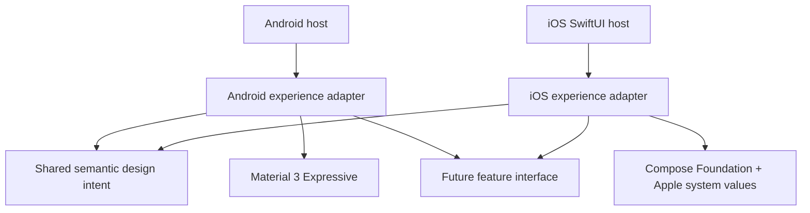
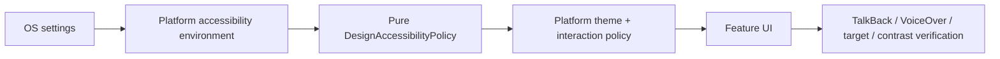

# Platform experience foundation

- **Status:** Accepted
- **Last updated:** 2026-07-22
- **Scope:** Theme, accessibility and platform seams; no onboarding feature UI
- **Product constraints:** [ADR-0001](../adr/0001-v1-product-foundation.md), `PRD-011`

## Architectural rule

Share stable meaning and behaviour; let each platform own rendering and interaction. `ReaderTheme` is the small public
interface used by future feature UI. Android and iOS are two real adapters at that seam. Android may expose Material 3
inside Android-only UI. iOS must not acquire a Material look through shared code.

| From | To | Meaning |
|---|---|---|
| Android host | Android adapter | The host owns lifecycle and edge-to-edge setup. |
| iOS SwiftUI host | iOS adapter | The host remains available for native navigation and real Liquid Glass controls. |
| Both adapters | Shared semantic intent | Spacing, minimum target and accessibility policy share meaning, not appearance. |
| Android adapter | Material 3 Expressive | `MaterialTheme`, dynamic color and Android component conventions live here. |
| iOS adapter | Compose Foundation and Apple values | Apple colors, typography and accessibility values live here; there is no iOS-to-Material edge. |
| Both adapters | Future feature interface | Onboarding can share state and capability while choosing platform-specific screens. |

## Source-set ownership

| Location | Owns | Must not own |
|---|---|---|
| `commonMain/core/designsystem` | Semantic roles, spacing intent, 48dp minimum target, pure accessibility policy, `ReaderTheme` interface | Android Material components, Apple glass effects, navigation |
| `androidMain/core/designsystem` | Material 3 theme mapping, dynamic color, Android accessibility environment | iOS appearance or shared product state |
| `iosMain/core/designsystem` | Apple light/dark palettes, scalable typography, iOS accessibility environment | `MaterialTheme` or imitation Material controls |
| `androidApp` / `iosApp` | Platform lifecycle, native shell, app packaging | Feature rules or duplicated design policy |

## Semantic token policy

`FoundationSpacing` and `FoundationSize` are shared because their intent is stable across both platforms.
`ReaderColors` and `ReaderTypography` expose semantic roles, while each adapter supplies different values. Shape,
blur/material, component chrome and navigation are intentionally not shared. A token is admitted only when both real
adapters consume the same meaning; hypothetical future reuse is insufficient.

Android maps semantic roles from `MaterialTheme.colorScheme` and `MaterialTheme.typography`, with Android 12+
dynamic color and static light/dark fallback. Experimental Expressive APIs must remain centralized behind the Android
adapter so Compose alpha changes do not leak into feature interfaces.

iOS uses Compose Foundation-facing semantic roles and Apple-scaled `sp` typography. Liquid Glass belongs to native
SwiftUI/UIKit navigation and controls in the host seam; a Compose blur imitation is not called Liquid Glass. Older iOS
versions require a graceful solid/material fallback.

## Accessibility data flow

| Setting | Foundation behaviour |
|---|---|
| Font scale / Dynamic Type | Typography uses scalable units; layouts must reflow rather than clip. |
| Reduced Motion | `MotionLevel.Reduced` disables decorative/spatial motion; state changes remain understandable. |
| Reduce Transparency | `usesTransparency=false` requires an opaque iOS material fallback. |
| Increased Contrast | `ContrastLevel.High` selects stronger semantic pairings; color is never the only cue. |
| Screen reader | Future controls require names, roles, state and meaningful traversal order. |
| Touch access | Every interactive target is at least `FoundationSize.minimumInteractiveTarget` (48dp). |

The policy is pure and tested through its public interface. Platform adapters read system preferences at the theme
seam. Onboarding must add semantics tests/previews for its actual controls; theme tests cannot prove an end-to-end
accessible journey.

## Evolution rule for onboarding

Tomorrow's first feature slice should define an onboarding state interface in a feature package, then implement one
Android screen and one iOS screen against it. Do not begin with a shared pixel-identical composable. Use the existing
theme seam, build the primary action with a 48dp target and semantic label, and prove the Reduced Motion variant in the
same tracer-bullet test cycle.

## Non-goals

This foundation does not decide onboarding steps or copy, add feed parsing/persistence, introduce accounts/sync, or
change any ADR-0001 decision. It does not promise that simulator compilation replaces device accessibility testing.
