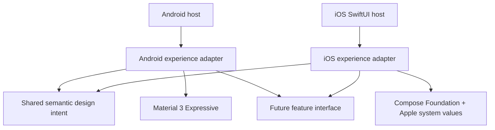
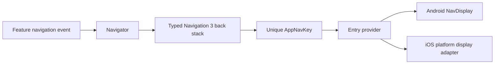
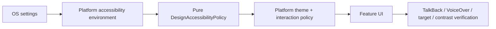

# Platform experience foundation

- **Status:** Accepted
- **Last updated:** 2026-07-23
- **Scope:** Theme, accessibility and platform seams; no onboarding feature UI
- **Product constraints:** [ADR-0001](../adr/0001-v1-product-foundation.md),
  [ADR-0002](../adr/0002-localization-and-navigation.md), `PRD-011`,
  `PRD-014`

## Architectural rule

Share stable meaning and behaviour; let each platform own rendering and interaction. `ReaderTheme` is the small public
interface used by future feature UI. Android and iOS are two real adapters at that seam. Android may expose Material 3
inside Android-only UI. iOS must not acquire a Material look through shared code.

| From | To | Meaning |
|---|---|---|
| Android host | Android adapter | The host owns lifecycle and edge-to-edge setup. |
| iOS SwiftUI host | iOS adapter | The host remains available for native navigation and real Liquid Glass controls. |
| Both adapters | Shared semantic intent | Spacing, minimum target and accessibility policy share meaning, not appearance. |
| Android adapter | Material 3 Expressive | `MaterialTheme`, dynamic color and Android component conventions live here. |
| iOS adapter | Compose Foundation and Apple values | Apple colors, typography and accessibility values live here; there is no iOS-to-Material edge. |
| Both adapters | Future feature interface | Onboarding can share state and capability while choosing platform-specific screens. |

## Source-set ownership

| Location | Owns | Must not own |
|---|---|---|
| `commonMain/core/designsystem` | Semantic roles, spacing intent, 48dp minimum target, pure accessibility policy, `ReaderTheme` interface | Android Material components, Apple glass effects, navigation |
| `androidMain/core/designsystem` | Material 3 theme mapping, dynamic color, Android accessibility environment | iOS appearance or shared product state |
| `iosMain/core/designsystem` | Apple light/dark palettes, scalable typography, iOS accessibility environment | `MaterialTheme` or imitation Material controls |
| `commonMain/core/navigation` | Navigation 3 runtime state, serializable `AppNavKey` types, back-stack operations and key-to-feature contracts | String routes, platform chrome, Android-only `NavDisplay`, localized copy or mutable domain objects |
| `androidMain/core/navigation` | Android Navigation 3 `NavDisplay`, predictive-back and Android scene strategy integration | iOS presentation or feature business rules |
| `iosMain/core/navigation` | Platform-appropriate renderer for the shared Navigation 3 runtime state and Apple back interaction | A second route model, Android `navigation3-ui`, or Material navigation chrome |
| `androidApp` / `iosApp` | Platform lifecycle, native shell, app packaging | Feature rules or duplicated design policy |

## Navigation 3 contract

Navigation 3 is the authoritative navigation model on both platforms. The app
owns one typed back stack whose elements implement an app-specific sealed
`AppNavKey : NavKey` contract. Every concrete key is `@Serializable`.

| From | To | Contract |
|---|---|---|
| Feature event | Navigator | Screens emit typed callbacks/events and never mutate or receive the back stack directly. |
| Navigator | Back stack | Push, pop, replace, and top-level selection are centralized and unit-testable. |
| Back stack | `AppNavKey` | No raw string route and no `Any`-typed stack is allowed. |
| Key | Entry provider | Every key resolves exhaustively to one feature entry; unknown keys fail during development rather than opening a fallback screen. |
| Entry provider | Android | Android uses the Navigation 3 UI `NavDisplay` and platform back behaviour. |
| Entry provider | iOS | iOS renders the same runtime state through an Apple-appropriate adapter; it must not maintain a second Swift/string route graph. |

Key identity is deliberate:

- a singleton destination is a `data object`;
- a destination for an entity is a `data class` containing only stable,
  serializable identifiers such as `feedId` or `entryId`;
- mutable domain objects, display strings, resource values, callbacks, and
  platform objects never belong in a key;
- when two simultaneous instances of the same entity must retain independent
  entry state, the key includes a stable `instanceId`; random IDs are not added
  when normal entity identity is sufficient;
- equality of a key means “the same logical navigation entry.” Key types and
  fields must therefore not be changed casually after release.

The common Navigation 3 runtime supports Kotlin/Native, but the AndroidX
Navigation 3 UI artifact is not assumed to be available as KMP UI. Android owns
`NavDisplay`; iOS owns a custom display adapter. Non-Android state restoration
uses the explicit serialisation configuration required by the selected stable
Navigation 3 version. Tests cover key uniqueness/equality, serialization
round-trips, back-stack restoration, and exhaustive entry resolution.

References: [Navigation 3 overview](https://developer.android.com/guide/navigation/navigation-3),
[state saving and `NavKey`](https://developer.android.com/guide/navigation/navigation-3/save-state),
[Navigation 3 KMP release notes](https://developer.android.com/jetpack/androidx/releases/navigation3).

## Localizable presentation contract

Shared Compose UI loads visible and assistive copy from
`commonMain/composeResources/values/strings.xml` through generated `Res.string`
accessors and `stringResource`/`getString`. Locale variants live in qualified
`values-<locale>` directories. Android- or iOS-only host copy uses that
platform's localizable resource system. Platform resources are allowed only
when the copy is genuinely platform-specific; they must not fork shared product
wording accidentally.

The rule applies to accessibility descriptions, semantics, errors, placeholders,
empty states, plural/format strings, notifications and platform chrome as well
as visible `Text`. Navigation keys contain identity only and never localized
copy. New production UI should use resources from its first tracer slice rather
than defer a hard-code cleanup until release.

Reference: [Compose Multiplatform string resources](https://kotlinlang.org/docs/multiplatform/compose-multiplatform-resources-usage.html),
[localizing strings](https://kotlinlang.org/docs/multiplatform/compose-localize-strings.html).

## Semantic token policy

`FoundationSpacing` and `FoundationSize` are shared because their intent is stable across both platforms.
`ReaderColors` and `ReaderTypography` expose semantic roles, while each adapter supplies different values. Shape,
blur/material, component chrome and navigation are intentionally not shared. A token is admitted only when both real
adapters consume the same meaning; hypothetical future reuse is insufficient.

Android maps semantic roles from `MaterialTheme.colorScheme` and `MaterialTheme.typography`, with Android 12+
dynamic color and static light/dark fallback. Experimental Expressive APIs must remain centralized behind the Android
adapter so Compose alpha changes do not leak into feature interfaces.

iOS uses Compose Foundation-facing semantic roles and Apple-scaled `sp` typography. Liquid Glass belongs to native
SwiftUI/UIKit navigation and controls in the host seam; a Compose blur imitation is not called Liquid Glass. Older iOS
versions require a graceful solid/material fallback.

## Accessibility data flow

| Setting | Foundation behaviour |
|---|---|
| Font scale / Dynamic Type | Typography uses scalable units; layouts must reflow rather than clip. |
| Reduced Motion | `MotionLevel.Reduced` disables decorative/spatial motion; state changes remain understandable. |
| Reduce Transparency | `usesTransparency=false` requires an opaque iOS material fallback. |
| Increased Contrast | `ContrastLevel.High` selects stronger semantic pairings; color is never the only cue. |
| Screen reader | Future controls require names, roles, state and meaningful traversal order. |
| Touch access | Every interactive target is at least `FoundationSize.minimumInteractiveTarget` (48dp). |

The policy is pure and tested through its public interface. Platform adapters read system preferences at the theme
seam. Onboarding must add semantics tests/previews for its actual controls; theme tests cannot prove an end-to-end
accessible journey.

## Evolution rule for onboarding

Tomorrow's first feature slice should define an onboarding state interface in a feature package, then implement one
Android screen and one iOS screen against it. Do not begin with a shared pixel-identical composable. Use the existing
theme seam, load all copy and semantic labels through localizable resources,
emit a typed Navigation 3 event using a unique `AppNavKey`, build the primary
action with a 48dp target and semantic label, and prove the Reduced Motion
variant in the same tracer-bullet test cycle.

## Non-goals

This foundation does not decide onboarding steps or copy, add feed parsing/persistence, introduce accounts/sync, or
change any ADR-0001 decision. It does not promise that simulator compilation replaces device accessibility testing.
