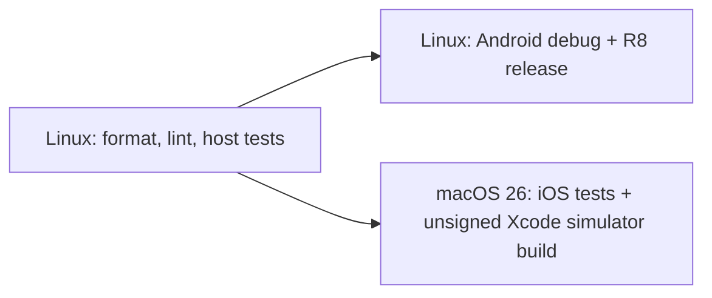

# Build and quality contract

- **Status:** Accepted
- **Last updated:** 2026-07-22
- **Scope:** Reproducible local and CI verification for the `reader/` project

## Supported toolchain

`reader/gradle/libs.versions.toml` is the source of truth for Kotlin, Compose and Android plugin versions. The
supported baseline is JDK 21, Gradle 9.1.0 through the checked-in wrapper, Android SDK 36, and Xcode 26.4 or a
compatible Xcode 26 patch. Kotlin 2.4.10, Compose Multiplatform 1.11.1 and AGP 9.0.1 are kept as the existing,
officially compatible set.

Never invoke a machine-installed Gradle. The wrapper JAR, scripts, properties and distribution checksum are part of
the build input.

## Fresh-checkout bootstrap

1. Install JDK 21 and Android SDK Platform/Build Tools 36.
2. On macOS, install Xcode 26 and select it with `xcode-select` when more than one version exists.
3. From `reader/`, run `./gradlew --version`.
4. Set `ANDROID_HOME` or create an untracked `reader/local.properties` with `sdk.dir=/absolute/path`.
5. Run the quality and platform commands below. Gradle downloads declared artifacts and Kotlin/Native on first use.

## Canonical commands

| Gate | Command from `reader/` | Success evidence |
|---|---|---|
| Format | `./gradlew ktlintFormat` | Kotlin and Gradle Kotlin files follow `.editorconfig`. |
| Format/lint check | `./gradlew ktlintCheck` | No formatting or Kotlin style violation. |
| Android lint | `./gradlew :androidApp:lintDebug` | Android/Compose lint report has no warning or error. |
| Shared host tests | `./gradlew :shared:testAndroidHostTest` | Common policies pass on the Android host. |
| Android app tests | `./gradlew :androidApp:testDebugUnitTest` | App-host tests pass; currently no feature tests exist. |
| Android builds | `./gradlew :androidApp:assembleDebug :androidApp:assembleRelease` | Debug APK and unsigned, minified release APK exist. |
| R8 invariant | `test -s androidApp/build/outputs/mapping/release/mapping.txt` | Non-empty R8 mapping proves shrinking ran. |
| iOS tests | `./gradlew :shared:iosSimulatorArm64Test :shared:checkXcodeProjectConfiguration` | Native tests pass and Xcode integration is consistent. |
| iOS app | See command below. | Xcode reports `BUILD SUCCEEDED` without signing. |
| Doc pairs | From repository root: `./scripts/verify-doc-pairs.sh` | Every canonical Markdown file has an HTML view and vice versa. |

The CI-safe iOS application build is:

```sh
xcodebuild \
  -project iosApp/iosApp.xcodeproj \
  -scheme iosApp \
  -configuration Debug \
  -destination 'generic/platform=iOS Simulator' \
  -derivedDataPath build/ios-derived-data \
  CODE_SIGNING_ALLOWED=NO \
  CODE_SIGNING_REQUIRED=NO \
  build
```

It compiles the Swift host, calls `:shared:embedAndSignAppleFrameworkForXcode`, and links a simulator app. It neither
boots a simulator nor needs an Apple team.

## CI topology



| From | To | Contract |
|---|---|---|
| Quality job | Android job | Android artifacts are built only after source gates pass. |
| Quality job | iOS job | Native compilation and the real Xcode app build run on macOS only. |

`gradle/actions/setup-gradle` owns the Gradle cache. The iOS job separately caches `~/.konan`; DerivedData is not
cached. Job commands intentionally match this document rather than using placeholder scripts.

## Platform invariants

- Android release keeps `isMinifyEnabled=true`, `isShrinkResources=true`, the optimized default rules and
  `proguard-rules.pro`. CI verifies the mapping file so R8 cannot be silently disabled.
- iOS declares both `iosArm64()` and `iosSimulatorArm64()`. CI targets the generic simulator and disables signing.
- `com.android.application` remains in the Android host module; the shared module uses AGP 9's
  `com.android.kotlin.multiplatform.library` plugin.

## Known limits

- A simulator build proves compilation and linking, not VoiceOver, motion, transparency or physical-device behaviour.
- Xcode 26.6 currently warns that Compose's bundled ICU object targets iOS Simulator 18.5 while the existing app
  deployment target is 18.2. The build succeeds; verify an 18.2 runtime before release or align the target deliberately.
- The first Kotlin/Native build can take several minutes while the compiler toolchain downloads.
- Xcode patch drift is visible in CI output. Update this contract and the compatibility evidence before changing the
  macOS runner or the Kotlin/Compose versions.
